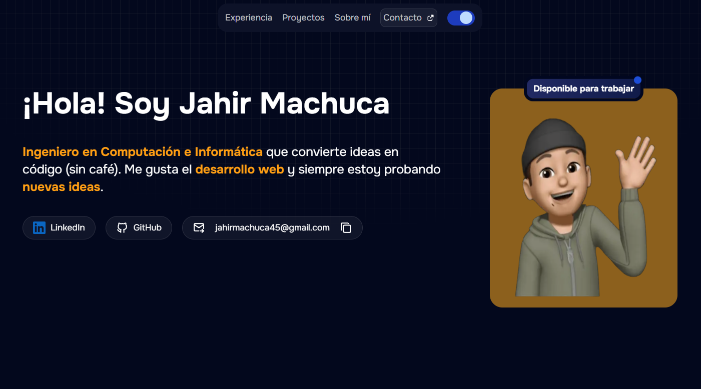

# 🌐 Portafolio de Jahir Machuca



Bienvenido a mi portafolio personal desarrollado con **React + TypeScript + Vite**.  
Aquí encontrarás una recopilación de mis proyectos, habilidades y experiencias como **Ingeniero en Computación e Informática** enfocado en el desarrollo web.

---

## 📋 Descripción

Este portafolio fue creado para mostrar mis capacidades técnicas y creativas, ofreciendo una vista clara de mis proyectos, tecnologías y trayectoria profesional.

Incluye:
- Proyectos destacados con descripciones y enlaces.
- Presentación de mis habilidades técnicas y blandas.
- Información de contacto y redes profesionales.

---

## 🚀 Tecnologías utilizadas

- **React** – Librería para la construcción de interfaces.
- **TypeScript** – Tipado estático para JavaScript.
- **Vite** – Herramienta de construcción rápida y moderna.
- **Tailwind CSS** – Estilos con enfoque utility-first.

---

## 📦 Instalación y uso

1. **Clonar el repositorio**
```bash
git clone https://github.com/JahirMM/portfolio.git
cd portfolio
```

2. **Instalar dependencias**
```bash
yarn install
```

3. **Modo desarrollo**
```bash
yarn dev
```

4. **Compilar para producción**
```bash
yarn build
```

5. **Previsualizar producción**
```bash
yarn preview
```

## 📬 Contacto
Email: Email: [j.machuca912@gmail.com](mailto:j.machuca912@gmail.com)  
LinkedIn: [linkedin.com/in/jahirmachuca](https://www.linkedin.com/in/jahir-machuca-martinez/)
GitHub: [github.com/tu-usuario](https://github.com/JahirMM)
